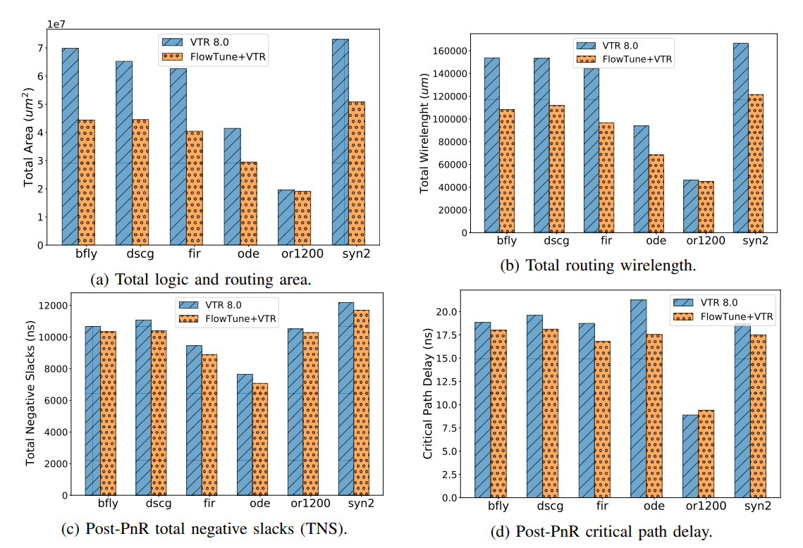
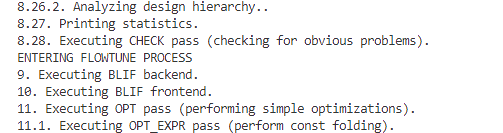
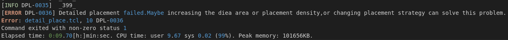
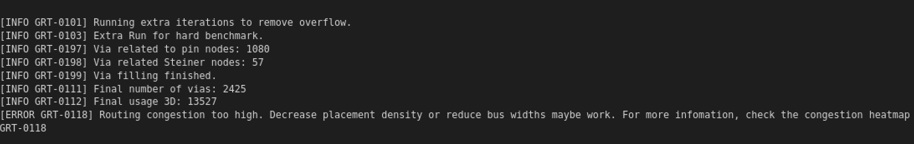

# ORFS Workflow Optimization
Our work mainly contains two contributions. For [detail information](./docs/openroad_contest.pdf)
 - We integrate [FlowTune](#FlowTune--orfs) into the OpenROAD Flow Script (ORFS);
 - We build a [Solution-inspiring error log system](#solution-inspiring-error-log-system).

### FlowTune + ORFS
We integrate [FlowTune](https://github.com/Yu-Utah/FlowTune) into the ORFS, with a primary focus on utilization during the ABC stage to achieve enhanced AIG reduction during synthesis. We conducted integration and validation on a small design prior to technology mapping, successfully completing the main process. 

We have learned about the main user issues on Github, consulted the experience of the Slack discussion group and the software development team, and combined our experience to explore the design of the solution-inspiring error log system.

We have read the source code of various components of OpenROAD and found the location of error log output under different steps. We have connected possible solutions to some common problems (such as: detailed placement failed; routing consensus too high; LVS error, etc.) with concise statements at the end of the log.

FlowTune is a light-weight reinforcement learning solution to synthesis. This work proposes a high-performance, domain-specific multi-stage multi-armed bandit framework for Boolean logic optimization called FlowTune. The framework takes advantage of domain-specific knowledge of DAG-aware synthesis algorithms to optimize standard-cell technology mapping and end-to-end PnR assessment using various backend tools. FlowTune outperforms prior works in terms of optimization efficiency and runtime, and it is the first framework that shows end-to-end synthesis experiments in terms of post-PnR performance indicators. The domain-specific MAB algorithm can be applied to a variety of DAG-based logic synthesis, with FlowTune being used for both AIG and MIG improvements.

OpenROAD Flow is a full RTL-to-GDS flow built entirely on open-source tools.
The project aims for automated, no-human-in-the-loop digital circuit design
with 24-hour turnaround time.

Due to time and many compatibility issues, we only used a small design to complete this process this time, so it is not obvious for actual optimization, but according to the introduction of this article itself, you can see that in Verilog-To -Routing (VTR), the optimization effect of this tool is as follows.

Post-routing evaluation with VTR (VPR PnR) as backend, with default VTR
7.0 flow as baseline where logic synthesis is conducted on [AIG logic optimization](https://scholar.google.com/scholar_url?url=https://dl.acm.org/doi/abs/10.1145/2617593&hl=zh-CN&sa=T&oi=gsb&ct=res&cd=0&d=13314604487856416829&ei=PaUjZKuXIN-Cy9YPmNy0oA8&scisig=AJ9-iYvfVfNmVaLWdggN_D6cUTbo) The collected results include (a) total area including logic and routing area, (b) total routing wire length, (c) post-PnR total negative slacks (TNS), and (d) [post-PnR critical path delay](https://scholar.google.com/scholar_url?url=https://ieeexplore.ieee.org/abstract/document/9916059/&hl=zh-CN&sa=T&oi=gsb&ct=res&cd=0&d=17216217603613571681&ei=gKUjZKzvDPqXy9YPy9SBoAs&scisig=AJ9-iYtE17YPgkDWQJQq5w2SkvGx)


### Install openroad with FlowTune
1. install openroad 
```
git clone --recursive https://github.com/b224hisl/OpenROAD-flow-scripts.git
cd OpenROAD-flow-scripts
cd tools/OpenROAD
sudo etc/DependencyInstaller.sh
cd ../..
./build_openroad.sh --local
source sourceme
#cd tools
#sudo dpkg -i klayout_0.28.5-1_amd64.deb #install klayout0.28.5-1
```
2. build FlowTune with openroad
```
wget https://download.open-mpi.org/release/open-mpi/v4.0/openmpi-4.0.1.tar.gz; tar -xvf openmpi-4.0.1.tar.gz
cd openmpi-4.0.1; ./configure; make -j12 all install
git clone https://github.com/Yu-Utah/FlowTune.git; cd FlowTune
cd src/; mkdir build; cd build; cmake ..
abc_dir_path="my \$abc_dir_path = \"$(pwd)\"" 
make -j12; export PATH=$PATH:$(pwd)
export PATH=$(pwd)/../../FlowTune-AIG-Optimization:$PATH
```
### How to use the FlowTune in ORFS
When #FLOW_TUNE is set to 1 in the flow/Makefile, a script can be invoked to perform FlowTune's optimization task. Additionally, there are also several related parameters in the flow/Makefile.
```
FLOW_TUNE_repeat: Number of appearances of each synthesis command
FLOW_TUNE_target: Targeted metric (default = 0, i.e., AIG Minization targeting number of AIG nodes)
                : t=0 AIG Minization - Minimizing AIG nodes                       :  ftune -d i10.aig -r 4 -t 0 -p 1 -i 10 -s 5 -L [other options]
                : t=1 AIG Minization - minimizing AIG levels                      :  ftune -d i10.aig -r 4 -t 1 -p 1 -i 10 -s 5 -L [other options]
                : t=2 Technology mapping (w Gate Sizing + STA) Min STA-Delay      :  ftune -d i10.aig -r 4 -t 2 -p 1 -i 10 -s 5 -L your.lib(Liberty) [other options]
                : t=3 Technology mapping (w Gate Sizing + STA) Min Area           :  ftune -d i10.aig -r 4 -t 3 -p 1 -i 10 -s 5 -L your.lib(Liberty) [other options]
                : t=4 FPGA Mapping - Miniziming Number of 6-input LUTs            :  ftune -d i10.aig -r 4 -t 4 -p 1 -i 10 -s 5 [other options]
                : t=5 FPGA Mapping - Miniziming Levels of 6-input LUT network     :  ftune -d i10.aig -r 4 -t 5 -p 1 -i 10 -s 5 [other options]
                : t=6 SAT (CNF) Minization - Miniziming Number of Clauses         :  ftune -d cnf.aig -r 4 -t 6 -p 1 -i 10 -s 5 [other options]
                : t=7 SAT (CNF) Minization - Miniziming Number of literals        :  ftune -d cnf.aig -r 4 -t 7 -p 1 -i 10 -s 5 [other options]
                : t=8 Regular Technology mapping using GENLIB (map) Min Delay     :  ftune -d i10.aig -r 4 -t 8 -p 1 -i 10 -s 5 -L your.genlib(GENLIB) [other options]
                : t=9 Regular Technology mapping using GENLIB (map) Min Area      :  ftune -d i10.aig -r 4 -t 9 -p 1 -i 10 -s 5 -L your.genlib(GENLIB) [other options]
FLOW_TUNE_iteration: Number of MAB iterations
FLOW_TUNE_sample: Number of MAB sampling for each iteration per Arm
FLOW_TUNE_stage
```
We give an example like this:
```
# r: Number of appearances of each synthesis command repeat
export FLOW_TUNE_repeat ?= 1
# t: Targeted metric (default = 0, i.e., AIG Minization targeting number of AIG nodes)
export FLOW_TUNE_target ?= 0
# i: Number of MAB iterations (default = 10)
export FLOW_TUNE_iteration ?= 1
# s: Number of MAB sampling for each iteration per Arm (default = 5)
export FLOW_TUNE_sample ?= 1
# s: stage (default = 5)
export FLOW_TUNE_stage ?= 1

```
After that you could use `make` to execute the OpenRoad Flow with FlowTune. Then you can view the log:
 

Note that you can use `make clean_FlowTune` to clear the intermediate files of FlowTune generated in the process, and use `make clean_all` to clear all files in the process
### Limitations
FlowTune is a parameter tuning framework that supports various optimization modes for Boolean logic optimization. Currently, the framework supports AIG optimization which we have add this tool into the ORFS, but it also offers FPGA optimization and technology mapping after synthesis. However, during the technology mapping phase, we encountered missing files in the imported ASAP7 library, as demonstrated in the code.
```
abc 01> read /workspace/0penROAD-flow-scripts/flow/results/asap7/gcd/base/output.blif
Line 10: Cannot find the model for subcircuit XOR2x2 ASAP7 75t R.Reading network from file has failed.
```

In addition, for complex designs that generate cells that cannot be recognized by Yosys, the framework may have difficulty during technology mapping before synthesis. 

FlowTune offers several different modes of operation, including:

- AIG Minimization Mode: Minimizing the number of AIG nodes or levels.
- Technology Mapping Mode: Mapping Boolean logic onto a target technology library using logic synthesis， optimization, and mapping techniques.
- FPGA Mapping Mode: Mapping Boolean logic onto FPGA resources to achieve minimum area or delay.
- SAT Minimization Mode: Minimizing the number of clauses or literals in the Boolean formula.

Moving forward, we plan to add support for all modes of operation in OpenROAD. we will collaborate with FlowTune and OpenROAD to incorporate more excellent features into ORFS and improve its compatibility and support for different modes.

## Solution-inspiring error log system
There are many common problems when using EDA tools to harden designs. Quickly resolving these issues will accelerate layout generation. However, for most beginners and designers, this is not an easy task: they need to check the EDA tool manual or load the design database with GUI to find the problem.

Therefore, to alleviate the issues, we gather a comprehensive list of common user problems that arise during OpenROAD program execution on the Github issue page. We have embedded hints for solutions in the error logs, which serve to inspire users and provide more direct debugging assistance, as well as a better understanding of the tool.

Here shows two demo logs:
- Fail in detail placement


- Fail in global rouing


### How to launch the system
We have already implement this system in Openroad, which is a submodule of ORFS, just execute this script when building:
```
./build_openroad.sh --local
``` 
It will atomatically clone our OpenROAD repertory (https://github.com/0616ygh/OpenROAD.git)
We are keeping to add more hints to OpenROAD parameter tuning system.

## Documentations

- See the OpenROAD [documentation here](https://openroad.readthedocs.io/en/latest/).
- How to [start using OpenROAD flow here](https://openroad-flow-scripts.readthedocs.io/en/latest/user/GettingStarted.html).
- Our [user guide here](https://openroad-flow-scripts.readthedocs.io/en/latest/user/UserGuide.html).
- Our [Flow Tutorial here](https://openroad-flow-scripts.readthedocs.io/en/latest/tutorials/FlowTutorial.html).
- Learn [more about FlowTune](https://github.com/Yu-Utah/FlowTune)

## Reference


```
@article{ajayi2019openroad,
  title={OpenROAD: Toward a Self-Driving, Open-Source Digital Layout Implementation Tool Chain},
  author={Ajayi, T and Blaauw, D and Chan, TB and Cheng, CK and Chhabria, VA and Choo, DK and Coltella, M and Dobre, S and Dreslinski, R and Foga{\c{c}}a, M and others},
  journal={Proc. GOMACTECH},
  pages={1105--1110},
  year={2019}
}

@inproceedings{ajayi2019toward,
  title={Toward an open-source digital flow: First learnings from the openroad project},
  author={Ajayi, Tutu and Chhabria, Vidya A and Foga{\c{c}}a, Mateus and Hashemi, Soheil and Hosny, Abdelrahman and Kahng, Andrew B and Kim, Minsoo and Lee, Jeongsup and Mallappa, Uday and Neseem, Marina and others},
  booktitle={Proceedings of the 56th Annual Design Automation Conference 2019},
  pages={1--4},
  year={2019}
}

@article{yu2022FlowTune,
  title={FlowTune: End-to-end Automatic Logic Optimization Exploration via Domain-specific Multi-armed Bandit},
  author={Neto, Walter Lau and Li, Yingjie and Gaillardon, Pierre-Emmanuel and Yu, Cunxi},
  journal={IEEE Transactions on Computer-Aided Design of Integrated Circuits and Systems (TCAD)},
  year={2022},
  publisher={IEEE}
}

@inproceedings{yu-mab-iccad2020,
title={Practical Multi-armed Bandits in Boolean Optimization},
author={Cunxi Yu},
booktitle={2020 International Conference On Computer Aided Design (ICCAD'20)},
year={2020},
}

@article{luu2014vtr,
  title={VTR 7.0: Next generation architecture and CAD system for FPGAs},
  author={Luu, Jason and Goeders, Jeffrey and Wainberg, Michael and Somerville, Andrew and Yu, Thien and Nasartschuk, Konstantin and Nasr, Miad and Wang, Sen and Liu, Tim and Ahmed, Nooruddin and others},
  journal={ACM Transactions on Reconfigurable Technology and Systems (TRETS)},
  volume={7},
  number={2},
  pages={1--30},
  year={2014},
  publisher={ACM New York, NY, USA}
}

```

A copy of this paper is available
[here](https://vlsicad.ucsd.edu/Publications/Conferences/371/c371.pdf) (PDF).


## License

The OpenROAD-flow-scripts repository (build and run scripts) has a BSD 3-Clause License.
The flow relies on several tools, platforms and designs that each have their own licenses:

- Find the tool license at: `OpenROAD-flow-scripts/tools/{tool}/` or `OpenROAD-flow-scripts/tools/OpenROAD/src/{tool}/`.
- Find the platform license at: `OpenROAD-flow-scripts/flow/platforms/{platform}/`.
- Find the design license at: `OpenROAD-flow-scripts/flow/designs/src/{design}/`.
- Find the FlowTune license at`https://github.com/Yu-Utah/FlowTune`


